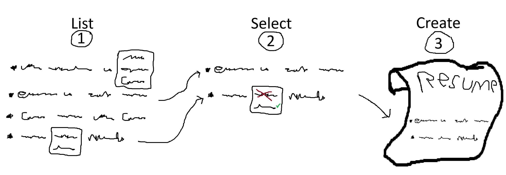

-----



The Resume Tailor is a small tool used to quickly and automatically tailor your resume to a job description. This allows you to have the best odds of getting your resume into the hands of actual humans. It does all this at the cost of about $0.02 to run. 

### How it works at a high level
The Resume Tailor works by taking in all of your experience, a resume template and a job description. The Resume Tailor then uses an LLM to select your experience that is most relevant to the job description and converts it into a format that the resume template expects. After which, the application generates a resume and places it into the `output/sharable_resumes` folder for you to send off to your future employer.

### Features
1. The Resume Tailor uses resume bullet points and modifications that you specify to populate the resume. This gives you full control over the wording of your resume, which ensures that your resume sounds like you rather than some AI.
2. The Resume Tailor allows you to specify what control over bullet point modification you give to the AI selector. This allows for keyword highlights. For example, you can highlight a specific programming language from a multi-language project.
3. The Resume Tailor is handmade and not vibe coded. It is under 2k lines of code. So with the aid of the documentation (or AI), it should be easy to extend this to suit your needs.
4. Using the Resume Tailor, you only have to record your experience once. The Resume Tailor can then transfer that experience to any template you choose.
5. Using AI (or your hands) you can easily turn any LaTeX resume into something that the Resume Tailor can populate with your experience, allowing for endless formatting possibilities.


## Quickstart
This project currently recommends using [Docker](https://www.docker.com/get-started/), [Visual Studio Code](https://code.visualstudio.com/docs/setup/setup-overview), and [VS Code's devcontainers](https://code.visualstudio.com/docs/devcontainers/tutorial). Please install all before continuing with the quickstart.

1. Open this repository within Visual Studio Code (VS Code).
2. Copy the `.env_template` file, rename the file to `.env` and populate the OPEN_ROUTER_API_KEY with your Open Router API Key.
3. Reopen this project in a devcontainer. To do this, in the very bottom left corner of the VS Code window, click the "><" icon and select "Reopen in Container".
4. Once it has built the environment, open a new terminal in the same VS Code instance. 
5. In that terminal run the command `run_resume_tailor_ui`
6. Paste this demo job description into the textbox
    ```
    Can you make toast? We are looking for the best toast make in the world to join our team. We need someone who can not only
    make avocado toast, but suffer through the hard times of earning just enough to buy the avocados. You will be responsible for
    making toast to the highest standards. Experience with various types of bread is a must. Knowledge of spreads is a plus, but
    not required. Join us at Tster to make the most beautiful toast the world has ever seen. And no the crusts cannot be cut off.
    ```
7. Click the submit button at the bottom left of the terminal
8. After about a minute or two it will output a latex and a pdf version of your resume. 
    - The latex version is located in `output/formatted_resumes`
    - The pdf version is located in `output/sharable_resumes`
8. Once you have confirmed that everything works, start adding in your experience within the `experience` folder. Use the [documentation](documentation/Experience.md) and experience templates already in there to get you started.
9. ***(optional)*** Create a resume template of your own by following the instructions [here](documentation/ResumeTemplate.md).
10. ***(optional)*** If you are not quite happy with the output and want to make a few tweaks without rerunning everything. You can do this by editing the latex output. Then running the command `compile_latex_file <full path to latex file>` in the terminal. If you want to change the [LLM output](documentation/LlmIntegration.md) here is the documentation for that

---

After all of that here is what the usual loop looks like*.

\****(I cut out some of the waiting)***

## Documentation
Documentation on how this all works, the FAQ section, and how you can extend it can be found [here](documentation/README.md).

## Similar Projects
The Resume Tailor is not alone in trying to conquer the perfect resume. Here are some other Open Source projects I have found. 

- [Resume Matcher](https://resumematcher.fyi/): Create tailored resumes for each job application with AI-powered suggestions. Works locally with Ollama or connect to your favorite LLM provider via API.
- [ResumeLLMe](https://github.com/IvanIsCoding/ResuLLMe): Reviews your resumes and helps you avoid common mistakes that occur while applying for jobs.
- [ResumeLM](https://resumelm.com/): ResumeLM is a free, open-source AI resume builder that helps job seekers create professional, ATS-optimized resumes that increase interview chances by up to 3x. Our intelligent platform combines cutting-edge AI technology with proven resume best practices to help you land your dream job.
- [YAMLResume](https://yamlresume.dev/): YAMLResume allows you to manage and version control your resumes using YAML and makes generating professional looking PDFs with beautiful typesetting a breeze.

Despite having tried all of these, I still felt compelled to build out the Resume Tailor. As a lot of them don't offer:
- Template Flexibility: All of these options provide you with few templates. It is tedious if you want to add your own.
- AI Output Flexibility: The options that use AI are complicated and often have many points of potential failure. 
- Extendability: All options are large projects that are intimidating to modify.


## Limitations
- Currently only works with LaTeX resumes
- Currently requires an Open Router key
