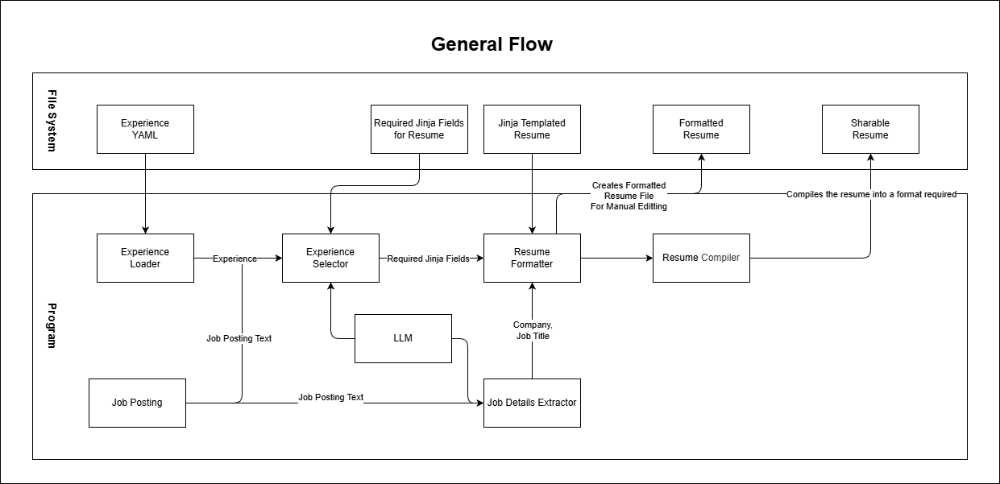

# Table of Contents
- [Resume Templates](ResumeTemplate.md)
- [Experience](Experience.md)
- [LLM Integration](LlmIntegration.md)

## High-level flow of the program
For the visual learners, here is a high-level overview of where everything in the program fits. If you want a more up to date and detailed version take a look at the draw.io files within the `documentation` folder.

## FAQ
- **Q**: I want to understand how this works, where should I start.
    - **A**: Read the main piece of code and start from there. The main entry point is in `src/resume_tailor.py` at the method `tailor_resume_to_job_description`. 
- **Q**: How do I ensure only one page is created
    - **A**: See the [Resume Template Documentation](ResumeTemplate.md). Specifically the `Keeping the Output of a Template to One Page` section.
- **Q**: Can I run this all locally
    - **A**: Unfortunately not at this moment. However, if you want to take it upon yourself to make the integration I have detailed what changes you need to make [here](LlmIntegration.md).
- **Q**: The LLM is making mistakes constantly. How do I fix this?
    - **A**: See the [LLM Integration Documentation](LlmIntegration.md). Specifically the `Changing The Output` section.
- **Q**: The Experience format does not suit my needs
    - **A**: See the [Experience Documentation](Experience.md). Specifically the `Updating the Experience Templates` section.
- **Q**: Why do you have the user use a devcontainer to run the program?
    - **A**: It allows me to build a minimal UI. As user journeys like output verification, adding new experience, and updating resume templates can all be handled by VS Code, so I don't have to build out a UI for each path. It does suck that it limits the audience, though.